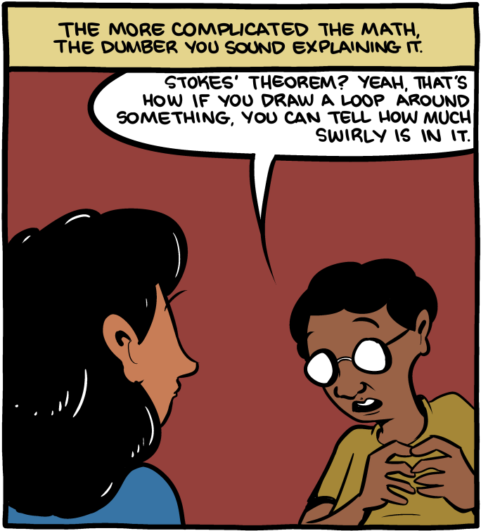

## Overview

-   About JIRA

-   Why I think it’s awesome

-   Filters

-   Boards

-   Things to try

-   Doing more with less

## What is a JIRA and how do I get one?

Jira is a tool developed by Atlassian for project management.

-   2002, Version 6.3.8

-   Predates the cloud

-   “Enterprise Strength”

-   Loved and Hated

-   No free option

## Why I think it’s awesome

Some cliches about powerful things.

## Filters: What are they?

A way of getting at every ticket that exists in JIRA served up any way that you want them.

## Filters: Why are they good?

-   Two strengths, Basic and Developer

-   Sharable

-   Savable

-   Confluence Integration

## Filters: Getting started

-   Go to issues and see what’s public

-   Click around in basic

-   Check it out in advanced (if brave)

-   Completion is your friend

## Boards: What are they?

Filters >>= Kanban

## Boards: Why are they good?

-   Day to day

-   Sprints

-   Overviews

## Boards: Getting Started

-   Make a filter

-   Make a board

## Food and Questions Break

## Android Workflow

-   Mirrors most (all?) web teams

-   Never delete issues

-   Tasteful validations

-   Lots of filters and boards

## Advanced: Things to try

-   Add/Delete fields

-   Create private boards

-   Subtasks

-   Epics

-   Add/Delete Issue types

-   Validations

-   Webhooks / API

## Additional Resources

Get them while they’re hot.

-   [Palantiri on Tolkien
    Gateway.](http://tolkiengateway.net/wiki/Palant%C3%ADri)

-   [Workflow Docs on
    JIRA](https://confluence.atlassian.com/display/JIRA/Configuring+Workflow)
